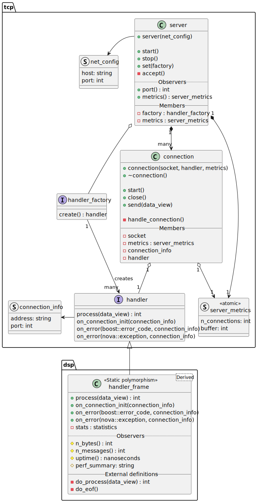

:root: ..
:dsp-headers: ../include/dsp

= User's Guide
:toc:

== Purpose

Data Stream Processing (DSP) is an SDK containing a runtime framework for
various services, from bare-metal to cloud services.

In a nutshell, it provides one southbound interface with possibly multiple
northbound interfaces and auxiliary interfaces for observability and for
runtime configuration.

== Interfaces

* Southbound:
** TCP server (PoC)
** UDP server
** Kafka consumer (PoC)
* Northbound
** TCP client (PoC)
** Kafka producer (PoC)
** File
** Stdout/stderr
* Observability interfaces
** Logging (PoC)
** Metrics (Under design)
** Alarms (No current plan)
* OAM interface
** HTTP
** Kafka

=== Northbound Interfaces

Northbound interfaces use a `message` type which has the following format.

NOTE: TODO: values should be byte arrays

[cols="1,1,3"]
|===
| Field | Type | Description

| Key
| Byte array
| Key of the message.

| Subject
| String
| A title, topic of the message. It can be used to route the message.

| Headers
| Key:String, Value:String
| Arbitrary data categorizing, labelling the message.

| Payload
| Byte array
| Arbitrary content of the message
|===

[source,cpp]
----
include::{dsp-headers}/cache.hh[tag=message]
----

Primary use-case is Kafka currently, the format might change in the future.

==== Kafka Producer Client

NOTE: stub section

=== Southbound Interfaces

The framework supports running only one southbound interface at any given time.
It is the first interface to be started when the service starts.

When the service is stopped, it requests the southbound interface to be stopped
before detaching all worker threads.

Binding application context enables to share arbitrary data that is opaque to
the framework. Implementations must wrap it together with DSP context, the
class interface expects `dsp::context` that contains various data, global
objects that are automatically exposed to client code.

Southbound interfaces use _Handlers_. They define what and how to process.

Handlers are created by factories. For example, each TCP connection creates its
own handler via the factory.

==== TCP Server

.Overall architecture

The server instantiates a connection handler when it receives a new TCP
connection which is then passed to a _connection object_. Server metrics are
shared with all connections, they are atomic. Each connection has a one
megabyte buffer serving the handler.

TCP connection handlers must adhere to the following interface.

[source,cpp]
----
include::{dsp-headers}/tcp_handler.hh[tag=tcp-handler]
----

`connection_info` contains information like IP address and port.

No exception can escape the TCP server. All uncaught exceptions in the handler
are sent back for error handling or explicit ignoring, then the connection is
closed.

A lightweight frame is provided for TCP handlers - `dsp::handler_frame` -,
which contains some boilerplate code, like logging and metrics. On connection
close the TCP server calls into `on_error()` with an error code. Exceptions are
used only for exceptional errors.

This handler frame must be inherited from via CRTP. The following functions
and a factory also needs to be defined.

[source,cpp]
----
class handler : public dsp::handler_frame<handler> {
public:
    auto do_process(nova::data_view) -> std::size_t;
    void do_eof();
};

class factory : public dsp::tcp_handler_factory {
public:
    factory(dsp::context ctx);
    auto create() -> std::unique_ptr<dsp::tcp::handler> override;
};
----

An example implementation is in `src/svc/handler.{cc,hh}`.

== Configuring Interfaces

In DSP Service, the interfaces are configurable via _Builders_ which makes
possible for the framework to pre-configure interfaces and leave some details
up to the client code. The `build()` function finalizes the configuration and
instantiates the interface.

== Supporting Library

=== Daemon

There is a _Daemon_ running on the main thread which makes sure that the main
thread does not fall off at the end of the code. `daemon::start()` must be
called to ensure that the background threads are not automatically joined.

This provides a safe OS signal handling. The following signals are recognized:

* SIGINT
* SIGTERM
* SIGUSR1
* SIGUSR2

The first two are stop signals, meaning the Daemon will stop.

Receiving SIGINT twice calls immediately into `std::abort`, which is a
**non-graceful** shutdown. It ensures that the program can be killed
with keyboard interrupt.

CAUTION: All _tasks_ on worker threads must make sure that upon joining the
thread, the destructor stops all threads. Stopping tasks is the responsibility
of the _Service_.

=== Profiling

The framework provides a wrapper around Tracy Profiler Client.
* A public header: `dsp/profiler.hh`
* A CMake target / library: `dsp-profiler`

The profiler functionality is enabled if `DSP_PROFILING` is defined.

NOTE: Transitive headers are not public, include directory must be specifically
set. This is avoiding the assumption that DSP is used as a Git submodule.

Client code must call `start_profiler()` and `stop_profiler()`. Tracy lifetime
must begin after main, static initialization in other libraries can cause nasty
things.

== Handlers

All handlers must contain a `dsp::cache`, that is the proxy between southbound
and northbound interfaces.

== Cache

The current implementation of `dsp::cache` is a simple proxy, it does not
actually hold any data. It just calls into all attached northbound interfaces.

NOTE: Design Goal - Mutlithreading, tasks, synchronization

== Runtime Framework

The _Service_ integrates the various components into a usable unit. It can be
constructed with a (YAML) configuration.

TCP server is provided by the service out of the box which is available through
`interfaces.southbound.type = "tcp"` configuration. The only configurable
parameter of the TCP server is the port. It accepts connections from all IP
addresses.

=== Configuration

[source,yaml]
----
include::{root}/res/dsp.yaml[]
----
